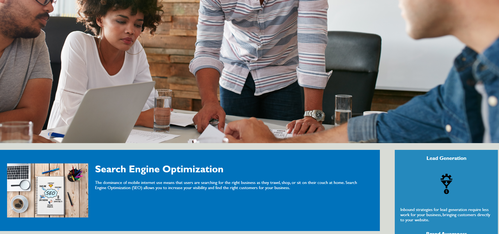

# Horiseon Accessibility Improvement

## Description

The object of this project was to take existing website code that was written in non-semantic HTML elements such as div and span, and change the HTML coding such that we used semantic elements, which are more descriptive of their structure and function in a page. This was to be done without altering the appearance of the webpage. In addition, changing the HTML elements caused many of the CSS selectors to break, so this taught me how to go step by step in the code and change aspects of the HTML file and side by side change corresponding aspects with the CSS file. In addition, I saw many CSS styles doing the same thing repeatedly so I combined them. This project also taught me the importance of version control and git adding and committing small chunks, because there was a point I broke everything and never saved or committed to have something to recover. 

Here is a screenshot showing that the website looks the same, yet many semantic elements changed under the hood. 

Website URL: https://atefhelmy.github.io/horiseon-accessibility-improvement/

Thank you for taking the time to look at my project and README :)

-Atef Helmy